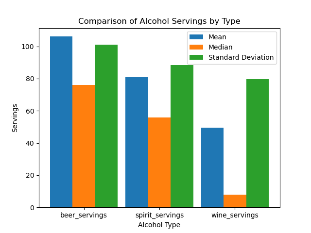

# IDS706 - Mini Project 3 - Ailina Aniwan

## Alcohol Consumption Data Analysis

### Project Overview

This project analyzes global alcohol consumption using the **drinks.csv** dataset from [FiveThirtyEight](https://github.com/fivethirtyeight/data). It uses Python with **Polars** for statistical analysis and **Matplotlib** for data visualization to explore the consumption of beer, spirits, and wine across different countries.

### Data Source

The dataset is sourced from [FiveThirtyEight’s alcohol consumption dataset](https://raw.githubusercontent.com/fivethirtyeight/data/master/alcohol-consumption/drinks.csv). It includes the following columns:
- **country**: The country name.
- **beer_servings**: Average beer servings per capita.
- **spirit_servings**: Average spirit servings per capita.
- **wine_servings**: Average wine servings per capita.
- **total_litres_of_pure_alcohol**: Total litres of pure alcohol consumed per capita.

Here’s how I loaded the dataset using **Polars** in the script:
```Python
import polars as pl

dataset = "https://raw.githubusercontent.com/fivethirtyeight/data/master/alcohol-consumption/drinks.csv"

def load_dataset():
    df = pl.read_csv(dataset)
    return df
```
The load_dataset() function uses pl.read_csv() to read the dataset from the provided URL and return a DataFrame for further analysis.

### Analysis and Calculations

#### 1. Descriptive Statistics
- **Mean**: The average number of servings.
- **Median**: The middle value in the data.
- **Standard Deviation**: The variability in servings across countries.

These statistics provide insights into the overall trends and distribution of alcohol consumption.

Here’s how these calculations were performed in my Python script:
```Python
def process_mean(df, col):
    return df[col].mean()

def process_median(df, col):
    return df[col].median()

def process_std(df, col):
    return df[col].std()
```
For each column (beer_servings, spirit_servings, wine_servings), the functions process_mean(), process_median(), and process_std() calculate the mean, median, and standard deviation, respectively.

Here are the summarized statistics for each category:

- **Beer Servings**:
  - Mean: 106.16
  - Median: 76.00
  - Standard Deviation: 101.14
- **Spirit Servings**:
  - Mean: 80.99
  - Median: 56.00
  - Standard Deviation: 88.28
- **Wine Servings**:
  - Mean: 49.45
  - Median: 8.00
  - Standard Deviation: 79.70
- **Total Litres of Pure Alcohol**:
  - Mean: 4.70
  - Median: 4.20
  - Standard Deviation: 3.77

These results were calculated using Polars and represent the central tendency and dispersion measures for alcohol consumption metrics by beverage type across various countries.

#### 2. Data Visualization

**grouped bar chart** was created to compare the mean, median, and standard deviation for beer, spirits, and wine. This visualization helps identify the central tendencies and spread of alcohol consumption across different categories.

Here is the code that was used to plot the grouped bar chart:
```Python
import matplotlib.pyplot as plt

def plot_summary_statistics(df):
    columns = ["beer_servings", "spirit_servings", "wine_servings"]
    means = df.select([pl.col(c).mean().alias(c + "_mean") for c in columns]).to_numpy()
    medians = df.select(
        [pl.col(c).median().alias(c + "_median") for c in columns]
    ).to_numpy()
    stds = df.select([pl.col(c).std().alias(c + "_std") for c in columns]).to_numpy()

    bar_width = 0.3
    bar_positions = range(len(columns))

    plt.bar(bar_positions, means[0], width=bar_width, label="Mean")
    plt.bar(
        [p + bar_width for p in bar_positions],
        medians[0],
        width=bar_width,
        label="Median",
    )
    plt.bar(
        [p + 2 * bar_width for p in bar_positions],
        stds[0],
        width=bar_width,
        label="Standard Deviation",
    )
    plt.title("Comparison of Alcohol Servings by Type")
    plt.ylabel("Servings")
    plt.xlabel("Alcohol Type")
    plt.xticks([p + bar_width for p in bar_positions], columns)
    plt.legend()
    plt.show()
```

Here is the chart generated:


According to the chart:

- **Beer Servings**: Beer has the highest mean and median servings, with relatively low variability (standard deviation).
- **Spirit Servings**: Spirits show high variability, as the standard deviation is almost equal to the mean, indicating greater inconsistency in consumption across countries.
- **Wine Servings**: Wine has the lowest mean and median, but a relatively large standard deviation, indicating that while average consumption is low, there are significant outliers.

### Testing

A **test_main.py** file was created to test the calculation functions (`process_mean()`, `process_median()`, and `process_std()`). It uses a sample dataset to verify the correctness of the statistics.

Here is the code in the **test_main.py**:
```python
import polars as pl
from main import process_mean, process_median, process_std

def test_statistics():
    data = {
        'beer_servings': [50, 60, 70],
        'spirit_servings': [80, 90, 100],
        'wine_servings': [20, 30, 40]
    }
    df = pl.DataFrame(data)

    print("Testing 'beer_servings' statistics...")
    expected_mean_beer = 60.00
    expected_median_beer = 60.00
    expected_std_beer = 10.00
    print(f"Expected mean: {expected_mean_beer:.2f}, Calculated mean: {process_mean(df, 'beer_servings'):.2f}")
    print(f"Expected median: {expected_median_beer:.2f}, Calculated median: {process_median(df, 'beer_servings'):.2f}")
    print(f"Expected standard deviation: {expected_std_beer:.2f}, Calculated standard deviation: {process_std(df, 'beer_servings'):.2f}")
    print()

    # Test other columns similarly...

if __name__ == "__main__":
    test_statistics()
```

This file tests the functionality of the mean, median, and standard deviation calculations using a sample dataset.